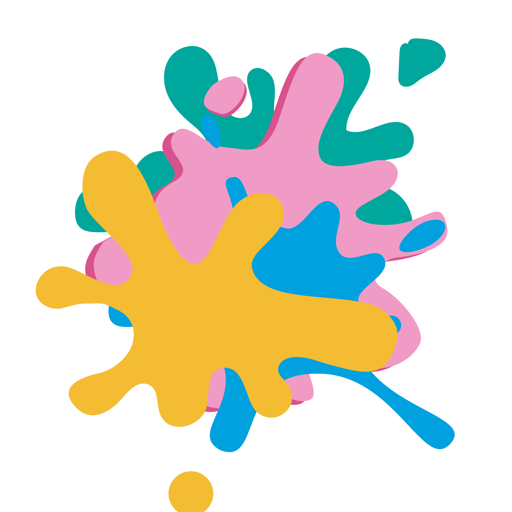

# matchIT. | Color Memory Game

**matchIT.** is a high-fidelity, minimalist color-memory challenge built with modern web technologies. Players are challenged to memorize a target color in exactly 3 seconds and then recreate it as accurately as possible using an intuitive color wheel and brightness controls.



## Tech Stack

- **Kernel**: [Next.js 16 (App Router)](https://nextjs.org/)
- **Runtime**: [React 19](https://react.dev/)
- **Animation Engine**: [Framer Motion 12](https://www.framer.com/motion/)
- **Styling**: [Tailwind CSS 4](https://tailwindcss.com/)
- **Type Safety**: [TypeScript](https://www.typescriptlang.org/)

---

## Getting Started

### Prerequisites
- Node.js 20+
- npm, yarn, or pnpm

### Installation

1. **Clone the repository:**
   ```bash
   git clone https://github.com/ketanBisht/matchit.git
   cd matchit
   ```

2. **Install dependencies:**
   ```bash
   npm install
   ```

3. **Run the development server:**
   ```bash
   npm run dev
   ```

Open [http://localhost:3000](http://localhost:3000) with your browser to see the result.

---

##  Project Structure

- `app/components/`: Core UI components.
  - `GameContainer.tsx`: The primary state machine managing game phases (Start, Study, Match, Results).
  - `ColorPicker.tsx`: A custom Canvas-based color wheel and HSV control system.
  - `ColorDisplay.tsx`: Reusable cards for displaying color swatches and metadata.
  - `DoodleElements.tsx`: Centralized repository for SVG brand elements and decorative doodles.
- `app/lib/`:
  - `game-logic.ts`: Contains the mathematical core—scoring algorithms, color conversion (RGB ↔ HSV), and percentage calculations.
- `app/globals.css`: Custom CSS variables and layout-specific tokens.

---

##  For Novice Developers

If you are just starting out, MatchIt is a great way to learn:

1. **React State Machines**: Notice how `GameContainer.tsx` uses a single `GameState` type to transition between different views without complex routing.
2. **Canvas Manipulation**: Check out `ColorPicker.tsx` to see how we procedurally generate a color wheel by calculating the Hue and Saturation of every pixel using Trigonometry.
3. **Framer Motion**: Explore how spring animations and `AnimatePresence` are used to make the UI feel "alive" and responsive to user actions.
4. **Color Math**: Look at `game-logic.ts` to understand how colors are represented as numerical data and how we calculate the "distance" between two colors to determine accuracy.

---

##  For Contributors

Looking to expand the game? Here are some ideas:

- **Sound Design**: Implement subtle UI sounds for matching, success, and round transitions.
- **Persistence**: Add `localStorage` support to track personal high scores across sessions.
- **Difficulty Levels**: Create advanced modes with shorter study times or shifting brightness.
- **Multiplayer**: Implement a simple "pass-the-device" mode or a real-time battle system.

---

##  License

This project is licensed under the MIT License - see the LICENSE file for details.

---

Created by **Ketan Bisht** with a focus on visual excellence.

